编程生涯，启发我的15本书
===

从几百本书中整理出一份书单是一件困难的事，但是从这些书中挑选出对自己影响比较大的书确是一件容易的事。

在是一份迟来的书单，但是并不是一份适用于每个人的书单。这是我在学习编程过程中看的一些书，启发到我的书，有很多你可能没有听过，也有很多可能是你耳熟能详的。之所以说是启发是因为很多说并没有那么好，但是我从上面获取到了一些灵感。

高中时期
---

高中时期，因为想开发游戏的热情才深入计算机世界。并且高中也是一个相当无聊的时期，除了为高考准备的考试，还有就是上课

###《C++游戏开发》

有一些书，你就没有必要去看了，比如这里的第一本书《C++游戏开发》，这本书是我在高中的时候翻了好几遍的书

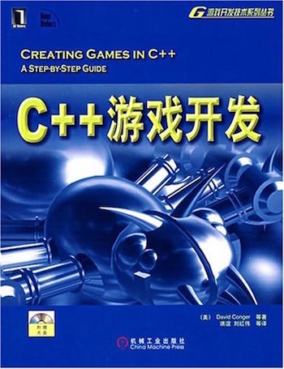

这本书一直在说“C++是一门优雅的语言”，也介绍了很多我在之前编程中不懂的知识点：数组、指针，以及高级点的重载和继承这一些面向对象的知识。这本书在游戏开发方面讲得不是很多，但是当时让我脑洞大开的是——2.5D编程。简单地来说，就是二张图片叠加在一起形成的3D效果。我才意识到当然我玩的很多游戏是这样做出来的。

我那之前我只会写点代码，并不知道一个游戏是如何在操作系统上运行的。在这本书中我学会了代码是如何通过操作系统的API来创建窗口、操作文件、操作声音等等。

其实上面说到的游戏开发的书应该是一整个系列，但是很多书启发性似乎并不大就不提了。记得还有《Java5 游戏编程》、《网络游戏开发》、《游戏开发核心技术•剧本与角色创造》等等的书。

###《3D游戏》

这是一本讲述3D游戏编程的书，实际上说的是如何去造一个游戏引擎。上图：

当然很多内容都看得不是很懂，这本书对我的帮助并不是技术本身，而是对于数学的提高和3D空间的理解。高中的知识本身并不多，多的是知识本身衍生出来的试题。换句话说，这样的书和上一本书一样，在我们遇到瓶颈的时候是很有帮助的，相当于帮我们打开了另外一片天空。原本我们以为世界是这样的，后来我们意识到了世界并不是这样的，世界比我们想象中的要大。

###《Linux内核设计与实现》

这本书并不是同上两本是一本启发性的书籍，但是是一本奠定基础的书籍。

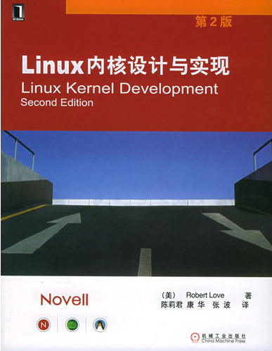

出于某种原因，加之发现一个人很难开发3D游戏。便开始学习游戏底层之下的技术——操作系统。于是很快地就从一个游戏开发爱好者变成了一个Kernel Hacker。很多东西都已经忘了，但是很多东西都记得很清楚。如Linux是一个宏内核，但是借助了微内核的很多思想。在当时的环境下，所谓的多进程是怎么一回事，他们多久切换一次进程等等。

除此，不得不提及的一本书是《Orange'S:一个操作系统的实现》，这本书在当时的映像是非常不错的。但是这本书放在我的家里吃灰尘了~~。

###《代码之美》

这本书开启了我的装B史~~，上图

由于这是一本合集，所以书中的大部分内容我没有看懂。但是，这本书让我看到了各种很Diao的代码。不过这并不重要，重要的是我在这本书里面认识了Emacs。这就是为什么这本书会上榜的原因。

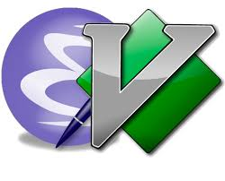

这本书中有多篇提到了Emacs，然后我就去试了！！！
这本书中有多篇提到了Emacs，然后我就去试了！！！
这本书中有多篇提到了Emacs，然后我就去试了！！！

大学
---

大学学的是硬件，所以在软件方面花费的经历并不是特别多，成长比较大的是大学最后的学习。

###《设计模式》

之所以买这本书的原因是：很多书中都提到了这本书，强调这本书是多么的重要。然后，我就买了。

当时写的语言基本上就是C、Python还有汇编，所以在当时并不特别懂，后面我们会继续说到。它给我的感觉就是，WOCAO，我当年的C++连入门都算不上。虽然能看懂，但是一知半解。主要是当时代码写得并不多，主要是在博览群书。

###《领域特定语言》

DSL大法好，DSL大法真的是一个很棒的想法。

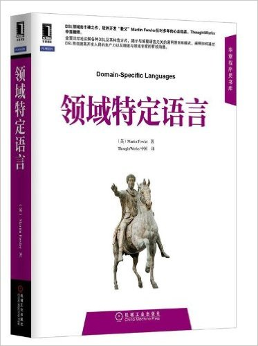

它可以用更简洁的语言业表达你的想法。这是很美好的一个想法，如果我们可以把我们的业务代码抽象成外部DSL的话，那么我们就不担心架构的变更、技术框架的落后。

###《SEO艺术》

当你有一篇好的文章，还有一个好的产品，你还需要什么？SEO就是其中一个。

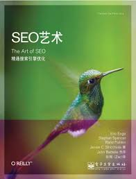

让我意识到一点：事物间的关联性——也就是Page Rank。当时对论文这种东西没啥概念，后来发现这是非常有趣的一个算法。

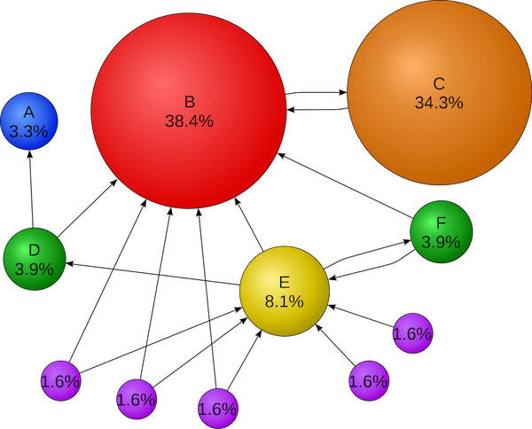

这个原则不仅仅适用于SEO领域，还适用于社交领域、大V经济领域。PR高的网站链接PR高的网站可能没有啥明显的作用，但是对提交PR低的网站特别有用。

###《重来》

《重来》似乎是一本经常被提及的书，好在我也是看过的，还写了几篇相关的文章。

这本书有三点说得很不错，换句话来说，这三点和我产生了共鸣：

1. 卖掉代码的副产品。事物间存在的连接属性。
2. 招聘笔杆子。这个就不用多说了，我写了那么多文章。
3. 音乐应在你的指尖流淌。好的装备确实能带来一些帮助，但事实是，你的演奏水平是由你自己的手指决定的。

ThoughtWorks面试与实习
---

大四的时候就开始找工作了，然后我就遇到了ThoughtWorks。面试的时候醒悟到了《重构》可以到《设计模式》，但是光醒悟并没有啥卵用，下面这本书是我后来的后来才遇到的。

###《重构与模式》

不知道在多少的场合里，我一直在吐槽这本书应该是叫《重构到设计模式》。

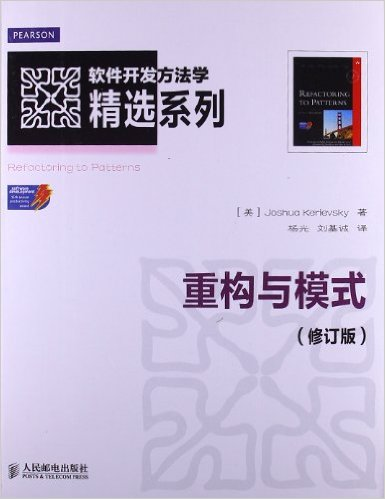

虽然并没有学到太多的实质性的东西——很多东西都在实习的时候已经学到了。重构和设计模式一样，光一天天做一些智力练习并没有啥用。从重构代码到抽象出设计模式，是一种很迷人的体验。

###《重构》

这本书虽然看得很早，但是提得很晚的原因是：主角总是最后才出场的。

在当时我也花了很多时间去识别书中的一些Code Smell，然后去重构。亲手把自己的代码从一坨x变得更易读是一种很棒的体验，你说呢？

###《敏捷软件开发》

这又是一本Jolt效率大奖的书，这似乎也是进入我们公司应该读的一本书。

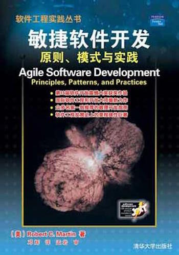

这本书结合了敏捷方法、模式和面向对象的一些思想，并提出了SOLID（单一功能、开闭原则、里氏替换、接口隔离以及依赖反转）这五个基本原则。

工作
---

###《持续交付 发布可靠软件的系统方法》

这倒不是一本对我启发非常大的书，主要是因为这已经是我们的日常工作流程。

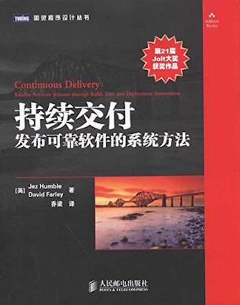

如果你先实践了，然后再去看一本书，那么你就不会觉得一本是多么的棒。软件本身是一种持续的过程，特别是Web开发来说。在这一点上来看，几乎所有的互联网公司都可以持续交付软件。但是国内的大部分互联网公司的代码都是没有测试的，并且呈现的是一种几乎有问题的持续交付模式。

###《面向模式的软件架构 卷1：模式系统》

作为另外一本Jolt效率大奖的书，这本书名副其实。

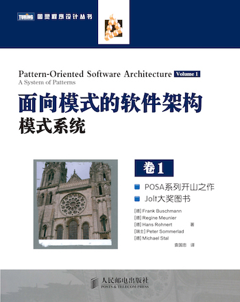

能从混乱到有序就可以抽象成一种架构模式，书中向我们展示了各个层面的模式是如何发挥作用的。这本书让我意识到了模式不仅仅存在于代码之间，又存在于架构之间，更是可以存在于我们的日常生活之中。

###《实现领域驱动设计》

尽管这本书提到的很多东西我都很了解，我还是不非常懂这本书。或许只是因为没有连接概念到代码上，让我在有空的时候再细细理解这本书。

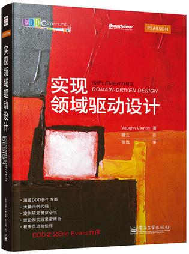

虽是如此，但是这本书中提到的六边形架构让我映象深刻，又可以称之为“端口和适配器架构”。

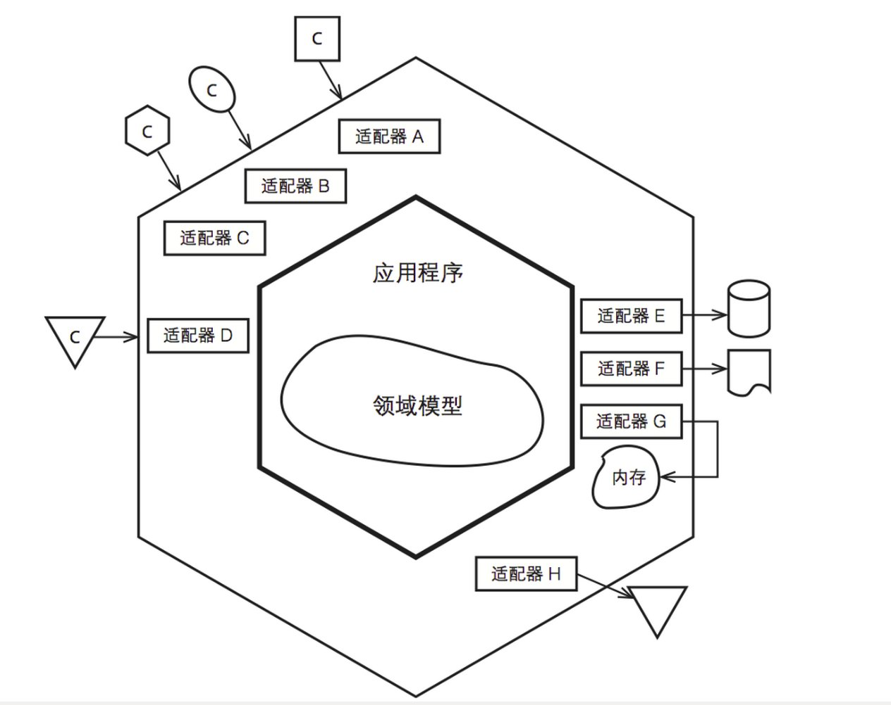

还有CQRS(命令和查询责任分离)架构，这种风格和我们现有系统的架构是类似的。在我们系统的架构中，读和写是两个不同的数据源，我相信这种结构也存在于很多的系统中。

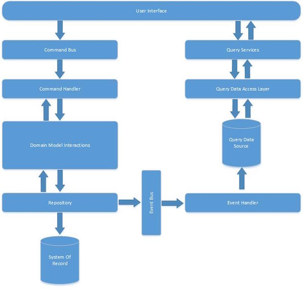

还有我之前提到过的[编辑-发布-开发分离](https://www.phodal.com/blog/editing-publishing-coding-seperate/)也是类似于这种风格的架构。

###《浮现式设计 专业软件开发的演进本质》

最后出现的这本书，让我重新理解了软件开发的演进。

浮现式设计这个概念很棒，软件不是一开始就产生的，面向Web开发的软件更是如此。由于业务发现的需要，我们不可能在一开始想到一切的可能性，我们只能在业务演进的同时发展我们的架构。

